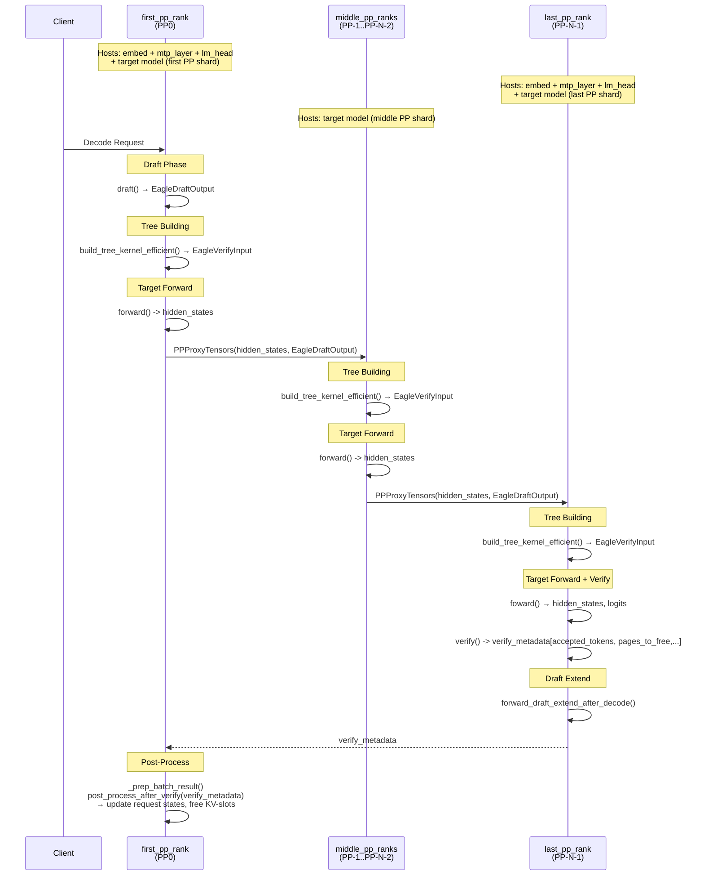

### Checklist

- [ ] If this is not a feature request but a general question, please start a discussion at https://github.com/sgl-project/sglang/discussions. Otherwise, it will be closed.
- [ ] Please use English. Otherwise, it will be closed.

### Motivation

I'd briefly share my plan of action on how we can support Speculative Decoding + PP in Disagg Decode Mode. Feel free to drop your comments/suggestions.

## Model Weights Layout 
- The speculative model weights will be duplicated loaded on `first_pp_rank` and `last_pp_rank`:
  - This implies duplicate `lm_head` on the `first_pp_rank` and duplicate `embed` on the `last_pp_rank`. 
- The target model weights will be set-up in the regular PP setting.

## Flow
- Draft Phase would happen on the `first_pp_rank` -> `draft_tokens`, `scores` would be sent to each PP-rank via the `PPProxyTensors` already implemented.
- Each individual PP-rank would materialize `build_tree_kernel_efficient()` to get `EagleVerifyInput`.
- The last PP-rank would run the `verify()` to get the `accepted_tokens` -> `verify_metadata` sent to the `first_pp_rank`.
- The last PP-rank would also run `forward_draft_extend_after_decode()`.
- `_prep_batch_result` would run the `post_process_after_verify(verify_metadata)` to update request states (finished/unfinished) and free unused KV-slots on the first PP-rank.
- `verify_metadata` would then be passed along to PP-1..PP-2 and so on for request state adjustment on each PP-rank.

## Diagram
## Speculative Decoding + Pipeline Parallelism in Disagg Decode Mode (Flow of a Microbatch)

## Target Worker
- I plan to extend `EagleWorker` module for this support (since PP doesn't support overlap mode anyways so there's no point working with `EagleWorker2`.

## Concerns
- Since `draft()` happens on first PP-rank and the `draft_extend_after_decode()` happens on last PP-rank, there is a necessity to pass `incremental KVCache` across PP-ranks -> Need some feedback on the feasibility of doing this.

### Related resources

_No response_
